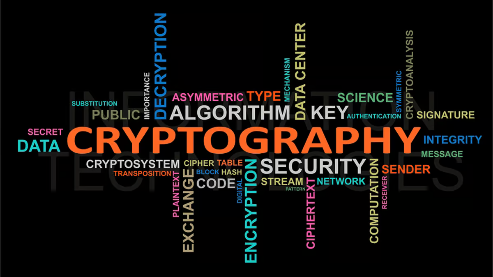

# 🔐 Cryptography Algorithms in Python

This repository contains basic implementations of classic cryptography algorithms in both C++ and Python. All codes are written for easy understanding and are beginner-friendly.



## 📜 List of Algorithms ( Python Implementaion )

- Playfair Cipher
- Hill Cipher
- DES (no external libraries)
- AES (no external libraries)
- MD5 (using `hashlib`)
- SHA512 (using `hashlib`)
- RSA (manual version )
- DSA (manual version)

## ✅ Features

- Simple input/output
- No external libraries unless mentioned
- Works on both Windows and Linux
- Easy to copy-paste and test for exams

## 📌 Note

Some algorithms like AES, DES, and RSA may not be secure in these simplified versions. These are intended for learning purposes only.

## 📂 How to Run

```bash
git clone https://github.com/PacemakerX/cryptoLab.git
cd cryptoLab
python <filename>.py
```

## Feel free to connect with me!

<p align="center">
  <a href="mailto:sparsh.officialwork@gmail.com">
    
  </a>
  <a href="https://www.linkedin.com/in/sparshsoni">
    
  </a>
</p>
